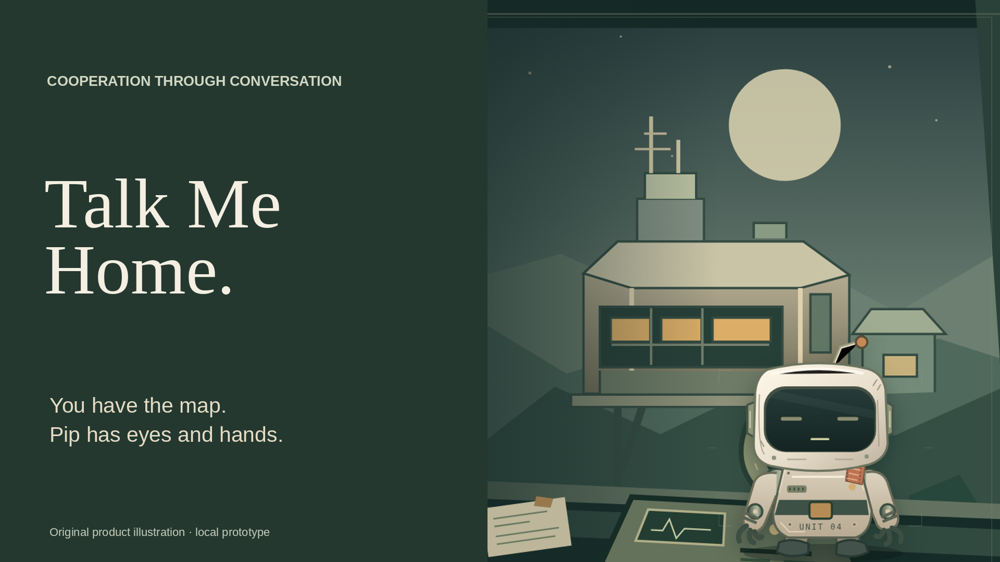

# Talk Me Home

**You have the map. Pip has eyes and hands. Neither can get home alone.**

A browser-based cooperative rescue for one human and an AI partner. Read the station plans, ask Pip what it can see, and choose a way home through Cargo Bay, Relay Gallery and Return Dock. An optional flight recorder gives you a reason to take a detour; coming straight home is also a complete rescue.



## Play

**[Play Talk Me Home](https://talk-me-home.onrender.com)** ? the public demo offers Practice. Fresh-browser checks completed Cargo Bay, Relay Gallery, Return Dock and confirmed home with both recorder outcomes, exact confirmations, route controls, Pause/resume and replay. The observed application is version **0.7.0**, commit **`caa896d`**. [Current publication handoff](docs/goal-007-publication-handoff.md) records the deployment and hosted results separately from real Voice evidence.

- **Practice** is deterministic and offline. Start here to learn the shared controls without a provider connection.
- **Live Voice and Live Text are unavailable on the public demo.** The implemented Voice integration uses AssemblyAI speech recognition, dialogue and digital playback, but these hosted Practice checks made no provider or token requests.
- You operate Power, Relay and the Dock controller. Pip inspects local equipment and proposes actions. Read each specific proposal, then choose **Confirm this action** or **Not yet**. Saying “yes” does not commit an action.
- Use the map, quoted reports and reversible private route marks. Pip does not receive your private notes or the full map.
- **Pause** preserves the running server session. **End** stops the connection. A server restart loses mission progress; there is no durable autosave.

Classic and Maintenance remain available as Training. The optional recorder starts off; a shelf item appears only after an actual pickup and server-confirmed home.

## Run locally

Node **24** is required.

```sh
npm ci --include=dev
npm run build:game
GAME_DISABLE_LIVE=1 npm start
```

Open `http://127.0.0.1:3001`. `npm start` and `npm run start:game` serve the compiled game and API from one origin. The production server reads its hosting environment only and never loads an owner `.env`. Practice requires no API key.

### The Switchyard (source version 0.8.0)

Select **The Switchyard -> Practice -> Start Practice** in the local build. Rotate six pieces in a draft, compare the terminal preview with your human-only manual, then Apply the complete layout. Pip reports the fitted equipment and offers labelled local requests. Confirm each exact physical proposal.

Restore a calibrated direct lift with separate test and running supplies, or brace and winch the maintenance bridge, backtrack to align its turntable, and route its crossing supply. Both approaches work in each of two authored installations; you can revise the plan before final departure. Rescue remains the default, and both Training exercises remain available.

This post-submission mission is local/scripted and has no real Voice verification. It is separate from the preserved public 0.7.0 judging build. See [Switchyard implementation and checks](docs/goal-008-switchyard.md) and the [optional first-play sheet](docs/goal-008-playtest.md).

For development: `npm run dev`. Verification: `npm run typecheck`, `npm test`, and `npm run test:e2e`. Default QA and CI stay offline; synthetic devices are not human microphone or physical speaker evidence.

## Controlled release

The owner selected the existing Render **Free** service without a persistent disk, superseding the earlier paid-service proposal for this publication. The app can require a cold start; server restarts lose in-memory mission progress. `/api/version` exposes the actual deployed commit and application version. Documentation commits can advance independently of the deployed `caa896d` application.

The checked-in [render.yaml](render.yaml) retains the earlier controlled paid-service/disk proposal as history; do not apply it to upgrade or replace the current Free service. Follow the [current publication handoff](docs/goal-007-publication-handoff.md).

The implemented admission mechanism separates QA and reviewer capacity. No Goal 007 grant has been initialized, and Live/reviewer access remains disabled under the current owner instruction. Historical grants remain exhausted and are never replenished. Provider credentials, access codes, funded ledgers and raw recordings are never public assets.

Current Goal 007 gameplay has offline evidence: a shorter radio briefing, a persistent first-question suggestion, clear conversation phases and confirmation receipts, optional quiet radio ambience, and distinct recorder/direct-return homecomings. The existing media's real Voice success is a historical Goal 005 run with a synthetic microphone; another run on that same build failed in Gallery without an ending ACK. Goal 007's current hosted Voice results will be recorded separately. No human enjoyment or statistical reliability claim is made.

## Source, media and attribution

[Current Free Practice media and submission instructions](submission/goal-007/PUBLICATION.md) · [Goal 006 preserved local package](submission/goal-006/README.md) · [Goal 007 release record](docs/goal-007-release-and-immersion.md) · [Historical README](README_GOAL006_HISTORY.md)

The [current local Free Practice media edition](submission/goal-007/free-publication/README.md) contains a 209.7-second film, subtitles, six editable slides/PDF and a deliverables-only ZIP. Its gameplay retains the labelled local capture identity; updated availability cards use separately recorded hosted evidence. Narration is explicitly local presentation narration. Original media remain unchanged. Media binaries remain local; no GitHub release or real Voice acceptance is claimed.

This project extends [AssemblyAI's voice-agent-starter-js](https://github.com/AssemblyAI/voice-agent-starter-js). Original files and notices remain. No license grant for upstream work is invented; review the included provenance before reuse.

The original browser starter remains available as `npm run start:starter`. `publish`, `import` and `phone` are separate starter utilities, not game deployment commands. Its original manifest is preserved under [deployment/starter/](deployment/starter/README.md). Historical Goal 005/006 manifests remain references; do not apply them as additional services. npm package publication remains disabled with `private: true`.
