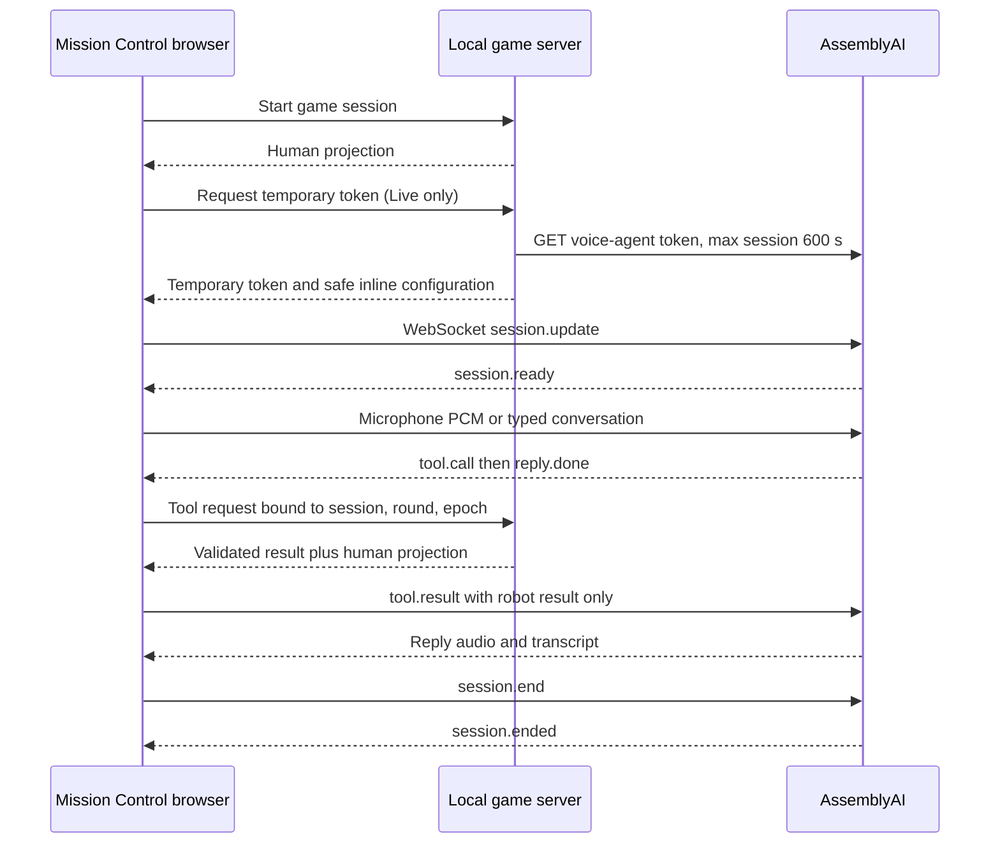

# Architecture

Talk Me Home is one human and one robot cooperating through one cargo-area Door. The React client is Mission Control; a small Node HTTP server is the authority. The original starter remains available for voice diagnostics and attribution.

## State and permissions

Each in-memory session owns Power, whether the Door is latched, robot location, round ID, revision, lifecycle status, and a cancellation epoch. Conveyor motion is derived from Power. Door opening is derived from Power or its Latch. Neither subtitles nor client animation can establish completion; only a valid move to the far side can.

The human projection contains identifiers, revision/epoch, commanded Power, mission status, and validated completion. It has no local camera feed, Latch flag, Door position, or Conveyor motion. Static map and wiring documents exist only in the UI. Robot observations describe reachable local equipment; tool results do not include the human projection sent alongside them to the browser. The initial robot configuration has only the premise, behavior instructions, and generic tool schemas. It contains no map, wiring relationships, solution sequence, or initial equipment observation.

Human `/power` and robot `/tools` routes bind actor permissions outside model arguments. The server rejects unknown fields and targets. Desired-state Power commands use revisions to reject stale updates. Call IDs deduplicate retries, and conflicting reuse is rejected. Observations and short atomic interactions are validated on the server. This supports paraphrased requests without checking a fixed dialogue sequence.

## Transport

Inline configuration omits `agent_id`. The standard AssemblyAI voice-agent stack supplies recognition, model reasoning, and speech. Typed input uses documented `conversation.message` followed by `reply.create`. It uses a real provider connection in Live mode. The original starter's capture resampler and playback ring buffer are adapted for the game. Capture checks the actual AudioContext sample rate and sends mono PCM16 at 24 kHz only after readiness. Playback cancellation empties the ring; it does not merely reset a timer.

English dialogue is controlled by the robot prompt and English voice `anna`. `input.transcription_prompt` supplies broad English conversation context; `input.language_codes: ["en"]` steers recognition. Raw transcripts are displayed as received. No puzzle answer or hidden equipment state is placed in transcription context.

## Interruption and lifecycle

Speech interruption clears queued audio and cancels pending tool work. A server epoch separates action cancellation from audio cancellation. A cancellation received before commit makes that action invalid; an action already committed remains part of the world. Tool preconditions are checked again at commit. Reset changes the round, so old callbacks cannot act on a fresh mission. Stop/end invalidate pending work, terminate the provider session, and clean up microphone tracks, AudioContexts, WebSocket, timers, and callbacks. Reconnection starts a fresh provider conversation rather than replaying uncertain tool calls.

The temporary token has a short start window distinct from the provider's maximum connected duration. Every development connection is capped at 600 seconds. The client also has a watchdog. Automated provider validation uses a separate persisted 180-second total allowance, a 60-second provider cap, a 45-second graceful-end timer, and an independent process watchdog. The test ledger is local and ignored by Git; it retains original reservations and only settles usage after acknowledged termination, with a conservative margin. A network failure can prevent clean provider acknowledgement and is reported honestly.

## Privacy and scope

The server binds to loopback and rejects foreign browser origins. This is a local solo prototype with no account authentication. A player inspecting developer tools can inspect or forge browser requests; the role split is a game rule, not a complete anti-cheat system. The token grants provider access and remains in memory only. There is no server transcript database or application recording feature. Live audio and typed messages leave the machine for AssemblyAI and are subject to that provider's data controls. Mock does not contact the provider. Restarting the server loses all sessions.
