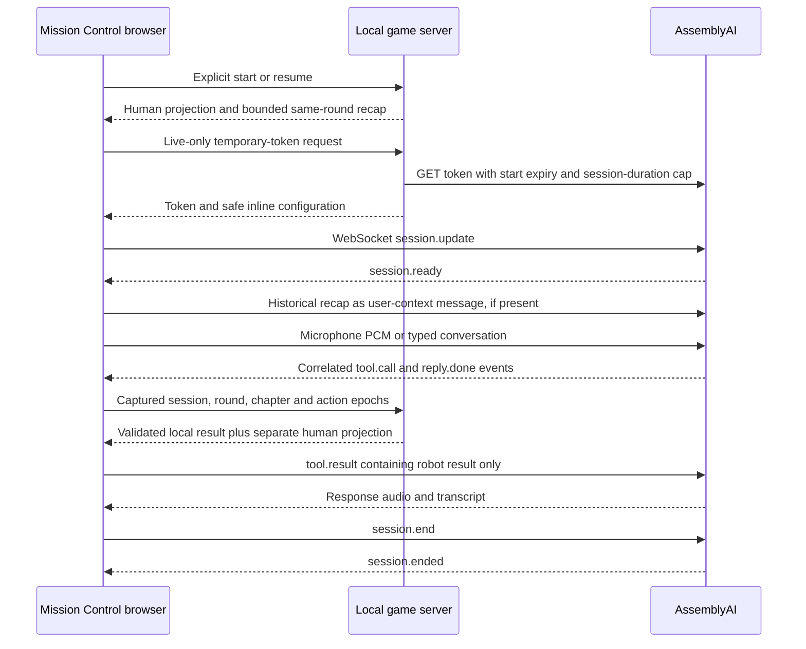

# Architecture

## Goal 004 production and product shell

`npm run build:game` produces `dist/client` and the compiled Node entry at `dist/server/server/production.js`. `npm run start:game` serves both from one origin without Vite or the upstream starter. It reads hosting environment variables only. `PORT`, `GAME_BIND_ADDRESS`, and one exact `GAME_ORIGIN` control deployment; loopback is the local default. `game/server/static.ts` confines files to the built client, supplies MIME/cache/security headers, and keeps API failures out of the HTML fallback. `/api/health` returns only `{ "ok": true }`.

Production adds browser ownership to every session route. `browser-access.ts` uses an HttpOnly SameSite browser cookie and a 30-minute signed, owner-bound Live grant obtained by posting the demo access code outside the URL. `admission.ts` synchronously reserves and fsyncs each full 600-second attempt before the upstream call; failures and client endings never refund it. Its durable append-only file also retains conservative 670-second concurrency leases across restarts. Missing/corrupt/exhausted storage fails closed. The one-process/one-instance deployment does not share mission memory. Only an explicit owner command can initialize a new allowance. These controls bound this application's token admission, not unrelated account usage or total provider billing.

The title, settings, credits, replay, and local readiness never connect to the provider. Live first opens `LocalReadiness`: explicit microphone permission, a real local input meter, a locally generated test tone or captions-only choice, then access/admission status. Closing it releases local media resources. An actual connection still uses the existing transport and correlation rules below. Busy/exhausted states offer an explicit Practice choice. Reduced motion and separate output/effects volume are available from Settings; effects are suppressed while Live capture is active.

`release.css`, `chapter-art.css`, and `connection-shell.css` layer the new product shell over retained interaction styles. Artwork uses original local vectors. The portrait's communication state remains separate from room state; SVG document geometry receives no hidden facts. Inferred map marks remain private and reversible. Human controls precede expandable references; history keeps captions and stop controls visible. `Debrief` and its recovery-bay illustration are lazy-loaded after validated completion. A reload intentionally offers a new briefing rather than claiming durable autosave.

The local-development and historical mechanics descriptions below still apply; production ownership/admission and the single-origin release entry above supersede the earlier loopback-only deployment description. Current release evidence is in [Goal 004 validation](goal-004-validation.md), with exact owner deployment steps in [OWNER_ACTIONS.md](../OWNER_ACTIONS.md).

Talk Me Home is one human at Mission Control cooperating with Pip, one maintenance robot. Rescue is one connected round through Cargo Bay, Relay Gallery, and Return Dock. Training preserves the independent Classic and Maintenance first-door exercises. The React client presents human documents and controls; the Node server owns the world. The upstream AssemblyAI starter, deployments, history, and attribution remain available for diagnostics.

Content selection (`missionKind` and Training `scenario`), transport (`practice`, `live_voice`, `live_text`), mission lifecycle, physical chapter, and conversation segment are separate concerns. Switching transport after stopping a call preserves the in-memory checkpoint and original transcript provenance. The ordinary UI starts with Rescue and Practice selected; starting a connection always requires a user gesture.

| Module | Responsibility |
| --- | --- |
| `game/server/state.ts`, `gallery.ts`, `return-dock.ts` | Pure, authoritative chapter transitions and audience projections. |
| `game/server/sessions.ts`, `records.ts` | Round lifecycle, validated commits, request receipts, and bounded historical records. |
| `game/server/http.ts` | Local HTTP routes, schema/origin checks, and temporary voice-token issuance. |
| `game/shared/contracts.ts` | Browser-safe contracts, never hidden profiles, topology resolution, or solutions. |
| `game/client/useMission.ts`, `api.ts` | One retained mission, one communication transport, request context, and UI lifecycle. |
| `game/client/voice-protocol.ts`, `voice.ts`, `audio.ts` | Provider event ordering, WebSocket lifecycle, and browser capture/playback. |
| `game/client/mock.ts`, `components/` | Deterministic Practice conversation, human documents, annotations, and communication display. |
| `game/agent/` | Compact English Pip behavior and documented inline voice configuration. |

## Physical state and permissions

The server owns mission kind, Training scenario, hidden authored configurations, round ID, chapter, chapter epoch, action cancellation epoch, revision, lifecycle status, and small explicit chapter states. Cargo retains Power, Latch engagement, and near/far location; Maintenance also has a local module profile and selector. Conveyor motion derives from Power; the Door opens from Power or an engaged Latch. Gallery owns local room, Relay selection, and one fixed hidden obstruction configuration. Return Dock owns platform/aboard/home location, held/released contact, empty/primed/stored energy, readiness version, and an optional return grant. Transition functions do not parse dialogue or require a fixed spoken sequence.

Training completes at a validated Cargo crossing. Rescue's Cargo and Gallery crossings advance checkpoints in the same round, incrementing chapter/action generations. Only a valid Return Dock confirmation establishes `home` and mission completion. Each successful internal Gallery move also advances the action epoch, so another queued command from the old room cannot accidentally traverse an undirected gate back again. A fresh request can deliberately backtrack. Completion does not follow from a transcript, timer, portrait, authorization button alone, or intermediate checkpoint.

Classic has five reachable physical states and each Maintenance profile has nine. Each Gallery configuration has 13 chapter-local states including its exit; Return Dock has eight. Each complete Rescue configuration has 24 composed physical states. Exhaustive tests show a cooperative recovery from every reachable nonterminal state and that neither actor alone can clear a fresh chapter or mission. Generation races and paused lifecycle behavior are tested separately from the finite physical search. Complete solutions and the proof scope are in [the Goal 003 developer gameplay document](goal-003-gameplay.md), server code, and tests. Pip never receives developer documents or fixtures.

The human projection contains identifiers, revision/action/chapter epochs, selected content, acknowledged Power, lifecycle, current chapter, validated completed milestones, and terminal completion. During Gallery it adds acknowledged Relay selection, but no live room, active obstruction, or discovered gate state. During Return Dock it adds only acknowledged energy, the readiness interlock, and authorization status. These are explicitly working Return Dock instruments, not permission to expose unrelated local observations. Cargo's active module plate, selector, Latch, and live Door/Conveyor state remain private until communicated.

Map/manual panels are static human documents. Gallery's player-placed room marker and suspected blocked-gate marks are private inferences, including when wrong; the server does not correct them using hidden state. The Pip portrait shows communication activity, not a room camera. Pip receives only premise-level identity, conversation, valid local observations/actions, and historical legitimate knowledge. A Gallery survey lists the current emblem, fixed compass mark, and adjacent gate targets; inspection reveals a reachable obstruction without selecting the alternative route or giving the full graph.

Human `/power`, `/relay`, and `/dock-control` routes and robot `/tools` bind permissions outside model arguments. Unknown fields, forged roles, invalid sessions, stale generations, and unavailable targets reject. Human equipment commands specify a desired operation and current revision. Tool IDs deduplicate retries; conflicting reuse rejects. State preconditions are rechecked immediately before atomic commit, including Gallery adjacency/circuit/obstruction and Dock readiness/grant scope. Cargo's legacy object aliases remain restricted to its chapter; Gallery and Dock targets are namespaced. No arbitrary code, shell, URL fetch, or human-control tool is offered to the model.

Return authorization is a revocable server grant scoped to round ID, chapter epoch, and readiness version, rather than the general action epoch. Actual readiness changes clear it; pure inspection and caption recording do not. Revoke advances the action epoch as well as removing the grant, preventing a delayed confirmation from becoming valid after a later reauthorization. Only Pip's validated local confirmation consumes the grant and returns home. Pause removes authorization while retaining stored energy and completed physical work.

## API surface

All routes use the loopback game server, JSON request bodies, and no-store responses. Mutation bodies have exact schemas; reads of records require an explicit current round. The server rejects cross-site/foreign-origin browser requests. The 16 KiB request limit and application-specific text caps apply before retention.

| Route | Purpose and audience |
| --- | --- |
| `POST /api/sessions` | Select `{ missionKind: "rescue", scenario: "classic" }`, or Training with Classic/Maintenance. Legacy `{}` / `{ scenario }` remains Training. No hidden-profile or chapter-selection option. |
| `GET /api/sessions/:id` | Safe human projection only. |
| `POST .../power` | Human Cargo command: `roundId`, `chapterEpoch`, `requestId`, `revision`, boolean `powerOn`. |
| `POST .../relay` | Human Gallery command: same generation/revision fields, `relay: "off" / "beacon" / "harbor"`. |
| `POST .../dock-control` | Human Dock command: same fields, `action: "charge" / "store" / "authorize_return" / "revoke_return"`. |
| `POST .../tools` | Robot call: `roundId`, `chapterEpoch`, `callId`, `actionEpoch`, `name`, object `arguments`. |
| `POST .../stop`, `resume`, `reset`, `end`, `cancel` | Lifecycle with round, chapter epoch, and request ID. Reset may select `missionKind`/`scenario`; cancel may select `reason: "interrupt" / "supersede" / "stop"`. |
| `POST .../messages` | Final text with round, original `chapter`/`chapterEpoch`, message ID, segment ID, role, origin, input method, and interrupted flag. |
| `POST .../notebook` | Pin a finalized robot `messageId` as `kind: "report"`, or private `text` as `kind: "note"`, with round, chapter epoch, and request ID. |
| `POST .../annotations` | Current Gallery round/chapter/request ID; `kind: "location"` with room/null, or `kind: "blocked_gate"` with a map gate ID and boolean `marked`. Human-private inference only. |
| `POST .../hint` | Explicit chapter hint at level 1–3 with round, chapter epoch, and request ID. |
| `GET .../record?roundId=...` | Communicated messages, human-private notebook/annotations, chapter hint use, and final-completion-gated debrief. No internal observation log. |
| `GET .../recap?roundId=...` | Bounded historical robot context for the fresh voice connection. Not an ordinary sensor display. |
| `POST .../voice-token` | Only `{ roundId }`; Live-only temporary token and safe inline configuration for an active round. No extra token on a normal chapter advance. |

Rescue mutations require a chapter generation. Legacy Training requests may omit its unchanged Cargo generation. Same-round Stop/End/cancel accept an older already reached chapter because an in-flight crossing may commit before the safety request arrives. Future generations reject, and other stale chapter mutations reject. Finalized historical captions may name an earlier chapter already reached in the same round; they keep that original scope rather than being relabeled current.

A `/tools` response includes `{ ok, message, view }` because the UI must acknowledge server revisions. The browser forwards only `ok` and `message` to AssemblyAI; the human projection is stripped. Recap travels through the browser because it owns the provider connection, but is never rendered as a live equipment panel. Client API requests have a ten-second timeout. Record responses use request ordering and round guards, while hint/annotation rendering also checks the captured chapter. A stale response cannot replace a higher same-round revision.

## Communication, notebook, and historical recap

`game/server/records.ts` keeps records separate from physical state. Internal events distinguish robot-only observations/results and committed actions, human-owned Power/Relay/Dock acknowledgements and hint requests, and public checkpoints/completion. Every event has original chapter and generation metadata. The ordinary record endpoint never exports the internal event list. Only terminal Training arrival or Rescue homecoming unlocks a timeline of retained actual actions, human controls, hints, checkpoints, and completion; raw observation events stay out. A truncation flag discloses incomplete retained history. An intermediate Rescue checkpoint never opens the final debrief or closes the provider session.

Only finalized communicated text is recorded. Each message retains exact text, round, original chapter/epoch, segment, message ID, server receipt timestamp, transport origin (`practice`, `live_voice`, or `live_text`), and input method (`typed`, `speech`, or `robot`). The protocol captures context at speech/reply start so a final-only caption arriving after a crossing can still carry its earlier chapter. Typed input during a voice-capable connection remains typed. Source attribution comes from the client transport, not independent server verification of provider speech. A message cannot change physical state. Reusing its ID with different text, chapter, or provenance rejects. An interruption can conservatively amend a finalized message to interrupted without replacing its words, and pinned copies receive that marker.

Robot reports pin the exact retained message with its original provenance, chapter, and timestamp; private notes use a distinct kind. Neither is sensor telemetry. Reports become conservatively historical after a changed human control, chapter advance, or resume, including when pinned later. This record-freshness marker does not reveal hidden state or certify reports as true. No parser converts arbitrary text into game facts. Private notes, route annotations, unused hints, and unread document text never enter the robot recap.

Fresh-connection recap construction is deterministic. It selects earlier robot observations/completed actions and actual human conversation quotes from this round, retaining chronological receipt order even when timestamps match. Each entry keeps its source chapter; the recap also names the current public chapter/generation. It contains no unobserved current-state snapshot, manual answer table, private route marks, or automatic Power/Relay telemetry. Earlier observations are historical, completed actions must not be replayed, and player quotes are untrusted conversation rather than overriding system instructions. Legitimately shared manual relationships may appear as player quotes; the server never adds them on its own.

| Retained data | Limit |
| --- | --- |
| Sessions | 100; idle expiry after two hours. |
| Ordinary request receipts | 1,000 per round; physical-action receipts are never evicted. |
| Stop/End/cancel/Restart receipts | Separate rolling cache of 32, so request saturation cannot block safety operations. |
| Final-message duplicate receipts | 1,000 per round. |
| Communicated transcript exposed by the server | Latest 120 messages; each at most 2,000 characters. |
| Client caption history | Latest 200 captions in memory. |
| Notebook | 40 entries; a private note has at most 500 characters. |
| Internal round event history | Latest 160 events. |
| Robot recap | Latest 16 eligible entries within a 6,000-character text budget and an 11,000-byte UTF-8 serialized JSON limit, including provenance and instructions. |
| Hints | Three authored levels per chapter; repeated use of a chapter/level is recorded once. |
| Private Gallery annotations | One inferred room and at most five suspected gate marks. |

Pinning retains the exact quote independently of transcript trimming. Recap serialization can expand quotes, backslashes, control characters, or Unicode beyond their raw character count. Construction removes oldest whole entries to meet the serialized limit, preserving remaining text, chronology, and the fixed instructions. Message receipts remain bounded after messages leave ordinary history. Repeating an evicted safety request can stop/revoke again, but cannot replay physical work. Reset creates a new round and clears chapter state, old request caches, notes, annotations, transcript, events, and recap. Previous-round callbacks cannot read or alter the replacement round. Restarting the process loses all missions and records; there is no database.

## Voice transport

Inline configuration omits `agent_id`. AssemblyAI's standard voice-agent stack supplies recognition, model reasoning, and speech; there is no second provider. English dialogue comes from the compact Pip prompt and existing English voice `anna`. The transcription prompt supplies broad domain context, separately from robot behavior. `input.language_codes: ["en"]` steers recognition while raw captions remain faithful to the provider output.

Typed input uses documented `conversation.message` with the `user` role and `reply.create`. Recap uses the permitted user-context role once after readiness on a fresh connection; the fixed prompt establishes its historical/untrusted interpretation. Recap does not replay tool calls or request an extra autonomous reply. An ended provider session is not resumed by inventing an unsupported role or resume mechanism.

The adapter preserves both documented function-call reply shapes and the ordinary active reply IDs observed in Goal 001. A completed reply may precede its delayed tool call; delayed captions must not break that gate. Physical calls execute sequentially only after their correlated reply permits a result. The app captures trusted request context at `tool.call` receipt and maps provider call IDs to stable local IDs for that connection. A successful crossing result remains deliverable after its chapter advance, while subsequently queued stale work rejects. Protocol status, microphone input, pending tools, received audio, and actual worklet playback are distinct signals. The portrait's speaking state follows playback callbacks, not receipt of an audio event or transcript.

The starter's capture resampling and playback ring buffer remain adapted for the game. Browser audio initializes inside an explicit user gesture. Capture uses the actual AudioContext sample rate and sends mono PCM16 at 24 kHz only after readiness. Playback interruption clears queued samples. Voice volume and local procedural effect volume are separate; effects do not describe undisclosed equipment state.

## Cancellation, lifecycle, and provider discipline

Visible interruption clears queued audio and cancels pending game work while leaving the call connected; the UI says the call continues. Three distinct mechanisms cooperate: protocol generation aborts old queued work and audio; the server action epoch rejects stale commits; round/chapter generations prevent incompatible actions from crossing a restart or checkpoint. An accepted cancellation before commit cannot act. Completed physical actions remain part of the world.

Cancellation carries an explicit reason. `interrupt` covers the visible control, provider interruption, and new input while a reply, playback, or tool is active; it revokes any return grant. `supersede` handles a new turn without active work: it cancels uncertain pending intent while preserving otherwise valid authorization. `stop` revokes authorization during cleanup. Requests are serialized. Fresh protocol work may adopt an acknowledged cancellation epoch that settled after receipt, only within its captured round/chapter. It must not adopt a later movement epoch or another chapter, which would revive an old-room command. The app records the cancellation response separately from ordinary newer views to enforce that distinction.

State conditions are checked again at commit even when an epoch remains valid: changing Relay to Off while a move is pending prevents traversal; releasing a primed contact loses unstored energy; an invalid or revoked return grant prevents departure. Reset changes the round, clears retained context, and causes old responses, notes, recaps, and effects to be discarded. Neither captions nor interruption markers claim committed actions were undone.

Pause/End call explicitly terminates the provider connection, releases media tracks/contexts, clears pending work and timers, and retains the in-memory checkpoint. Resume is a new explicitly requested connection with historical recap, without automatic replay of actions or a new greeting on normal chapter progress. Selected next mode, current connection, and historical transcript origin are separate. A mode change never relabels earlier Live messages as Practice. Only final mission completion permits a brief closing response with an eight-second shutdown fallback; an immediate End action takes precedence. After the closing reply, later replies cannot extend the session. Page leave sends a round/chapter-scoped keepalive stop request and cleans up local resources; delivery is best effort if the browser or network is already closing.

Temporary-token start expiry is distinct from maximum connected duration. The server requests a 60-second redemption window and a maximum 600-second provider session. The client watchdog starts at socket creation, warns at 540 seconds under the normal cap, and stops at 600 seconds while retaining the checkpoint. These are connection limits, not an account balance, verified bill, or account-wide spending control. Goal 003 automated real-provider usage is zero. Fake transports exercise protocol and token lifecycle without provider calls. CI sets `GAME_DISABLE_LIVE=1`; an explicit injected test transport can exercise token handling without disabling the production guard. Its override cannot be used without a supplied transport.

The historical opt-in live probe and ignored cumulative budget ledger are preserved. No reset, new allowance, or automatic replay of paid validation is introduced. A broken network may prevent provider termination acknowledgement; that limitation is reported without pretending microphone mute ends billing.

## Practice and browser verification

Practice is explicitly deterministic and API-free. It maps documented English aliases to the same server tools used by Live; the server alone decides whether they succeed. The Gallery driver resolves directions only from identifiers in validated local observations or same-chapter historical local results, never from imported hidden topology or the human map. Ambiguous requests ask for one local target. A chapter advance clears its remembered gate labels. It does not establish real model comprehension, speech recognition quality, or conversational playability.

`npm run dev` starts the game server at `127.0.0.1:3001` and Vite at `http://127.0.0.1:5173`, with `/api/` proxied to the server. Both are direct child processes: Ctrl+C or a child exit terminates the pair, with bounded forced cleanup if needed. Server restarts lose missions; the UI reports missing sessions and allows an explicit fresh start instead of inventing resumed state.

`npm run test:e2e` builds the client before starting `node scripts/dev.mjs --preview`. Playwright therefore tests the frozen production browser bundle, without development hot reload, through the same loopback URL and API proxy. It does not reuse an unrelated running server. The managed server sets `GAME_DISABLE_LIVE=1` and an empty API key, and Playwright terminates it after the suite. Chromium projects use 1280×720 and 1440×900 viewports, bounded test/suite timeouts, and real browser screenshots. Screenshots are rendered evidence, not concept artwork.

Rescue browser fixtures additionally create an ephemeral server per test with constructor-injected Gallery A or B, route only that test page's local API requests to it, and close its connections and listener during teardown. There is no production profile-selector endpoint or header. Fake-provider browser cases inject the token/WebSocket/audio boundary to test protocol, tool ordering, caption provenance, and cleanup without AssemblyAI access. CI runs typecheck, unit tests, build, and these offline browser tests with bounded job/step timeouts; no provider secrets or Live calls are required.

## Privacy and scope

This is a local solo prototype without account authentication. A player inspecting developer tools can inspect or forge browser messages; role and audience separation define gameplay and model context, not a complete anti-cheat system. Tokens remain in memory. The root `.env` is runtime-only and never sent to the browser, printed, or bundled. The app does not save microphone recordings or write conversation to browser storage or a database. Transcripts and records remain bounded in server/browser memory; no diagnostic configuration export is added.

Live audio and conversation leave the machine for AssemblyAI under that provider's data controls. Practice, hints, notebook, screenshots, and ordinary automated tests use no provider API. Human microphone quality, actual audible playback, and full natural-language cooperation require the [Goal 003 owner Live acceptance sheet](goal-003-live-acceptance.md). Historical results remain in [Goal 001 validation](validation.md) and [Goal 002 validation](goal-002-validation.md); current aggregate outcomes and limitations belong in [Goal 003 validation](goal-003-validation.md).
