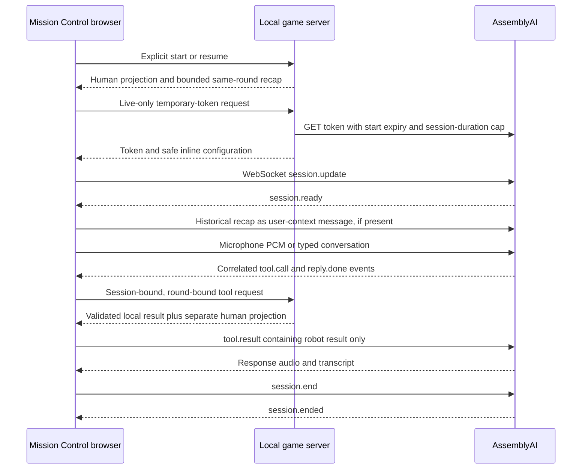

# Architecture

Talk Me Home is one human and Pip, one maintenance robot, cooperating through one cargo-area Door. Classic and Maintenance share the same small server-authoritative room. The React client is Mission Control. The upstream AssemblyAI starter, deployments, history, and attribution remain available for diagnostics.

## Physical state and permissions

`game/server/state.ts` owns the explicit scenario, server-selected Maintenance profile, selector, Power, Latch engagement, robot location, round ID, revision, lifecycle status, and cancellation epoch. Conveyor motion derives from Power; the Door opens from Power or an engaged Latch. Only a valid server move to the far side establishes completion. The deterministic transition functions do not parse dialogue or require a fixed spoken sequence.

Classic has five reachable physical states. Each Maintenance profile has nine. Exhaustive tests show that every reachable nonterminal physical state has a cooperative recovery path and that neither actor alone can finish a fresh round. The complete developer solution and mechanical proof are confined to [the developer gameplay document](goal-002-gameplay.md), server code, and tests. The human manual intentionally contains both Maintenance plate-to-setting rows, without identifying the installed plate.

The human projection contains only identifiers, revision/epoch, selected scenario, acknowledged Power, lifecycle status, and completion. It does not reveal the active plate, selector, Latch, local Door or Conveyor state, or robot location before arrival. Map and manual panels are static human documents. The portrait is a communication portrait, not a room camera.

Human `/power` and robot `/tools` routes bind permissions outside model arguments. Unknown fields and targets are rejected. Power requests specify desired ON/OFF and a current revision. Tool IDs deduplicate retries; conflicting reuse is rejected. State preconditions are checked immediately before an atomic commit. A robot can obtain observations and manipulate only reachable local objects. No arbitrary code, shell, URL fetch, or remote Power tool is offered to the model.

## API surface

All routes use the loopback game server, JSON request bodies, and no-store responses. Mutation bodies have exact schemas; reads of records require an explicit current round. The server rejects cross-site/foreign-origin browser requests. The 16 KiB request limit and application-specific text caps apply before retention.

| Route | Purpose and audience |
| --- | --- |
| `POST /api/sessions` | Create Classic with `{}` or choose `{ scenario: "classic" }` / `{ scenario: "maintenance" }`. No hidden-profile option. |
| `GET /api/sessions/:id` | Safe human projection only. |
| `POST .../power` | Human command: `roundId`, `requestId`, `revision`, `powerOn`. |
| `POST .../tools` | Robot call: `roundId`, `callId`, `actionEpoch`, `name`, `arguments`. |
| `POST .../stop`, `resume`, `reset`, `end`, `cancel` | Lifecycle with current `roundId` and `requestId`. Only reset accepts optional `scenario`. |
| `POST .../messages` | Finalized communicated text with `roundId`, `messageId`, `segmentId`, `role`, `text`, `origin`, `inputMethod`, `interrupted`. |
| `POST .../notebook` | Pin a finalized robot `messageId` as `kind: "report"`, or create private `text` as `kind: "note"`, with current round and request ID. |
| `POST .../hint` | Explicit request for `level: 1` or `2`, with current round and request ID. |
| `GET .../record?roundId=...` | Public messages, private human notebook, hints used, and completion-gated debrief. No internal observation log. |
| `GET .../recap?roundId=...` | Bounded historical robot context for the fresh voice connection. Not an ordinary sensor display. |
| `POST .../voice-token` | Live-only temporary token and safe inline configuration for the current active round. |

`game/shared/contracts.ts` defines browser-safe transport contracts. Full physical state and profile-to-setting resolution are server-only. A `/tools` response includes `{ ok, message, view }` because the UI must acknowledge server revisions. The browser forwards only `ok` and `message` to AssemblyAI; the human projection is stripped. Recap travels through the browser because it owns the provider connection, but is never rendered as a live equipment panel.

## Communication, notebook, and historical recap

`game/server/records.ts` keeps records separate from physical state. Internal events explicitly distinguish robot-only observations/results, robot physical transitions, human-owned Power acknowledgements and hint requests, and public completion. The ordinary record endpoint never exports the internal event list. Once the server confirms arrival, it exposes a timeline of retained real transitions, Power commands, hints, and completion; observations stay out of this timeline. A truncation flag discloses incomplete retained history.

Only finalized communicated text is recorded. Each message retains its exact text, round, segment, message ID, server receipt timestamp, transport origin (`practice`, `live_voice`, or `live_text`), and input method (`typed`, `speech`, or `robot`). Typed input during a voice-capable connection remains typed. Source attribution comes from the client transport, not an independent server verification of provider speech. A message cannot change physical state. Reusing its ID with different text or provenance is rejected. An interruption can conservatively amend an existing message to interrupted without replacing its words, and pinned copies receive that marker.

Robot reports pin the exact retained message with its original provenance and timestamp; private notes use a distinct kind. Neither is sensor telemetry. A report captured before an acknowledged Power change or resume receives an earlier-report flag, including when pinned after that event. This uses a public lifecycle epoch rather than inspecting hidden state. No parser converts arbitrary text into game facts. Private notes and unread document text are never included in the robot recap.

Fresh-connection recap construction is deterministic. It selects earlier robot observations/completed actions and actual human conversation quotes from this round, retaining their chronological receipt order even when timestamps match. It contains no unobserved current-state snapshot, manual answer table, or automatic Power telemetry. Earlier observations are explicitly historical, completed actions must not be replayed, and player quotes are untrusted conversation rather than new system instructions. Legitimately shared manual relationships may appear as player quotes; the server never adds them on its own.

| Retained data | Limit |
| --- | --- |
| Sessions | 100; idle expiry after two hours. |
| Idempotent tool/Power/lifecycle/notebook/hint requests | 1,000 per round. |
| Final-message duplicate receipts | 1,000 per round. |
| Communicated transcript exposed by the server | Latest 120 messages; each at most 2,000 characters. |
| Client caption history | Latest 200 captions in memory. |
| Notebook | 40 entries; a private note has at most 500 characters. |
| Internal round event history | Latest 160 events. |
| Robot recap | Latest 16 eligible entries within a 6,000-character text budget and an 11,000-byte UTF-8 serialized JSON limit, including provenance and instructions. |
| Hints | Two authored levels; repeated use of one level is recorded once. |

Pinning retains the exact quote independently of transcript trimming. Recap serialization can expand quotes, backslashes, control characters, or Unicode beyond their raw character count. When its serialized limit is exceeded, construction removes oldest whole entries while retaining chronology, exact remaining text, and the fixed historical/untrusted instructions. The duplicate-receipt cache is bounded even after a message leaves ordinary history. Reset creates a new round and clears state, old request caches, notes, transcript, events, and recap. Previous-round callbacks cannot read or alter the replacement round. Restarting the process loses all missions and records; there is no database.

## Voice transport

Inline configuration omits `agent_id`. AssemblyAI's standard voice-agent stack supplies recognition, model reasoning, and speech; there is no second provider. English dialogue comes from the compact Pip prompt and existing English voice `anna`. The transcription prompt supplies broad domain context, separately from robot behavior. `input.language_codes: ["en"]` steers recognition while raw captions remain faithful to the provider output.

Typed input uses documented `conversation.message` with the `user` role and `reply.create`. Recap uses the permitted user-context role once after readiness on a fresh connection; the fixed prompt establishes its historical/untrusted interpretation. Recap does not replay tool calls or request an extra autonomous reply. An ended provider session is not resumed by inventing an unsupported role or resume mechanism.

The adapter preserves both documented function-call reply shapes and the ordinary active reply IDs observed in Goal 001. A completed reply may precede its delayed tool call; delayed captions must not break that gate. Physical calls execute sequentially. Protocol status, active microphone input, pending tools, received audio, and actual worklet playback are distinct signals. The portrait's speaking state follows playback callbacks, not receipt of an audio event or transcript.

The starter's capture resampling and playback ring buffer remain adapted for the game. Browser audio initializes inside an explicit user gesture. Capture uses the actual AudioContext sample rate and sends mono PCM16 at 24 kHz only after readiness. Playback interruption clears queued samples. Voice volume and local procedural effect volume are separate; effects do not describe undisclosed equipment state.

## Cancellation, lifecycle, and provider discipline

Visible interruption clears queued audio and cancels pending game work while leaving the call connected; the UI says the call continues. A cancellation epoch separates audio interruption from physical rollback. An action canceled before commit cannot act. A completed action remains part of the world. Reset changes the round so stale responses, notes, recaps, and portrait effects cannot complete a new mission.

Pause/End call explicitly terminates the provider connection, releases media tracks/contexts, clears pending work and timers, and retains the in-memory checkpoint. Resume is a new explicitly requested connection with historical recap. Selected next mode, current connection, and historical transcript origin are separate. A mode change never relabels earlier Live messages as Practice. Completion permits a brief closing response with a bounded eight-second shutdown fallback; an immediate End action takes precedence. Page leave also requests stop and cleans up local resources.

Temporary-token start expiry is distinct from maximum connected duration. The server requests a 60-second redemption window and a maximum 600-second provider session; the client also has a watchdog. These are session limits, not account-wide spending controls. Goal 002 automatic real-provider usage is zero by policy. Fake transports exercise the protocol and token lifecycle without provider calls. CI sets `GAME_DISABLE_LIVE=1`; an explicit injected test transport can exercise token handling without disabling the production guard. Its override cannot be used without a supplied transport.

The historical opt-in live probe and ignored cumulative budget ledger are preserved. No reset, new allowance, or automatic replay of paid validation is introduced. A broken network may prevent provider termination acknowledgement; that limitation is reported without pretending microphone mute ends billing.

## Privacy and scope

This is a local solo prototype without account authentication. A player inspecting developer tools can inspect or forge browser messages; role and audience separation define gameplay and model context, not a complete anti-cheat system. Tokens remain in memory. The root `.env` is runtime-only and never sent to the browser, printed, or bundled. No microphone recording, silent transcript persistence, browser-state database, or diagnostic configuration export is added.

Live audio and conversation leave the machine for AssemblyAI under that provider's data controls. Practice, hints, notebook, screenshots, and ordinary automated tests use no provider API. Human microphone quality, actual audible playback, and full natural-language cooperation require the separate manual acceptance sheet. Historical Goal 001 tests and Live timings remain in [their original validation record](validation.md); new work is documented in [Goal 002 validation](goal-002-validation.md).
