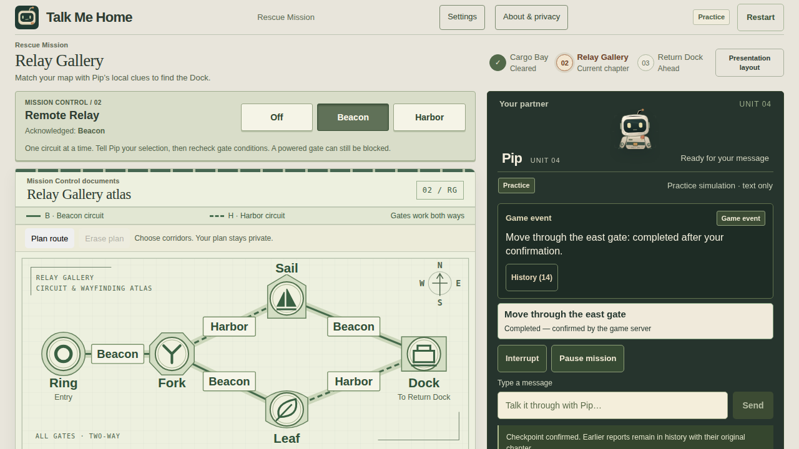
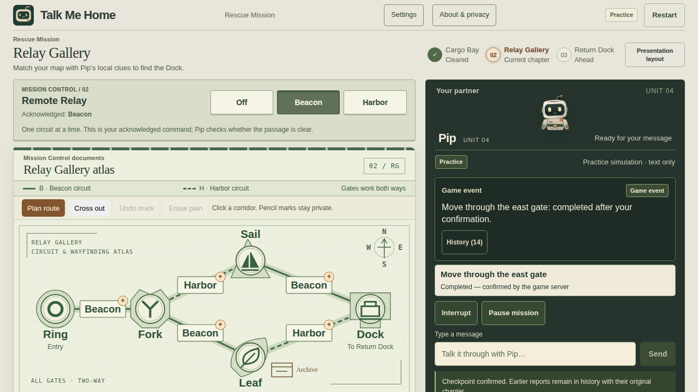
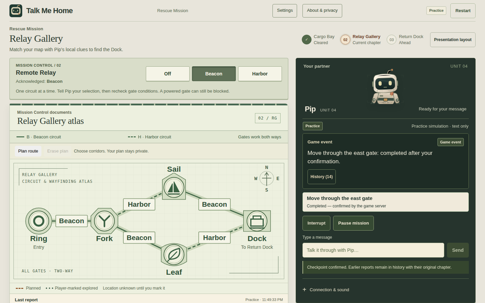
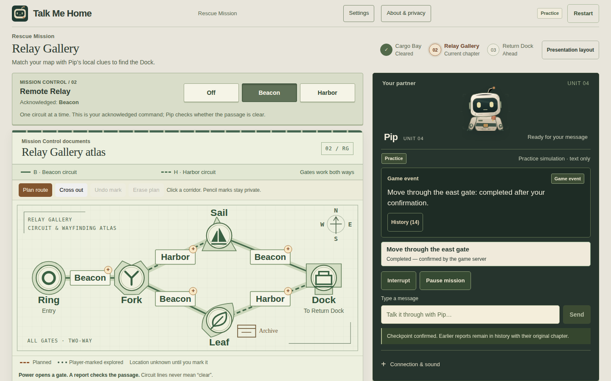

# Goal 006 — A Rescue Worth Remembering

Goal 006 makes the shared decisions easier to read and adds one optional choice with a visible consequence: bring Pip's flight recorder home, or complete the rescue without it. The new gameplay is implemented and exercised in Practice. Its effect on human enjoyment is a design hypothesis, not a measured result. `RELEASE_NOT_LIVE_VERIFIED` remains.

Work is isolated in `/home/mhirotaka/workspace/talk-me-home-goal-006`, on `work/goal-006-gameplay-and-submission`, based on delivered stabilization `ec9766dae2ff1eafb0d6559d637a1517a878e08a`. No new provider request, token attempt or funded allowance is authorized or used. Original-workspace files and processes are not the implementation target.

## What the player can decide

| Area | Preserved foundation | Goal 006 change and intended effect |
| --- | --- | --- |
| Start and Cargo | Asymmetric roles, local Latch, one shared Power supply, exact physical confirmation | A short premise and example question, optional help, and a prominent branching-supply drawing. The player still interprets Pip's observations; there is no answer sequence overlay. |
| Gallery | Two authored obstruction layouts, shaped emblems, fixed compass, private route marks, exact quotes and freshness, `inspect_gate` | Direct route marking, visible Cross out and Undo, and attached reports at a player-selected map association. Changing a plan preserves the report that motivated it. The atlas never chooses a route or displays a robot-location sensor. |
| Dock | Hold, Charge, Store, release, board, current return grant, confirmed return | A five-part procedure strip separates temporary charge, retained energy and return permission. Local contact/boarding remain Pip's observations; only the existing public instruments activate indicators. |
| Home | Server-confirmed completion and existing arrival art | The arrival and short authored story take precedence; detailed counts are behind “Remember the journey.” A recovered recorder appears on the shelf only after an actual pickup and home. Replay returns to explicit setup. |
| Pip | Faithful Live transcripts, validated arrivals, actual playback/waiting animation | Revised concise character guidance: apprehensive at first, useful in cooperation, quietly appreciative at home. Read-only questions need no second permission. This revised provider behavior has not been tested with real Voice. |

Original procedural sound cues are retained, not claimed as new music or ambience. They require a user gesture, respect volume/mute and yield to speech. Confirmation and home cues follow admitted outcomes; hidden equipment does not drive sound or artwork. Waiting text describes the actual stage and leaves local planning available.

## One optional object, two legitimate endings

“Bring back the flight recorder” is an explicit Rescue-only start selection, off by default. Restart and a new briefing clear it; changing to Training clears it too. The ordinary Rescue and both Training exercises remain available.

The archive is always at **Leaf**, regardless of which final gate is obstructed. Fork–Leaf is traversable in both layouts. In layout A, Leaf can already be on the successful route; collecting is then an additional choice without an additional traversal. In layout B, visiting Leaf requires returning to Fork before taking the other service branch. The human-visible archive label therefore identifies a destination, never the hidden correct exit. The archive's fixed position is intentional authored information; the player may infer that an extra visit could be needed, but not which final passage is clear.

Pip learns about the object only from a validated local survey, including confirmed arrival. A read describes the worn case and its flight-notes label. A specific pickup proposal still needs the owning browser's exact confirmation. The server checks current round, chapter, action generation, observed object and visit at admission and commit; returning to the same room creates a new visit. Information-only conversation cannot commit a pickup. Unknown/remote objects, forged fields, duplicates, expiry, canceled work and stale visits fail safely. Replayed successful decisions return their existing receipt without another commit.

The secured boolean is server-owned. It changes no gate, Relay, charge storage, return grant or completion condition. `HumanView` exposes the selected modifier but no live inventory; `recoveredFlightRecorder` appears only at confirmed home. Without the recorder, the story still celebrates a complete rescue. There is no inventory screen, fourth chapter, timer penalty or extra authorization system.

Practice remembers only admitted local results. Integration review caught a continuity defect: it forgot a secured recorder on entering Dock. The fix carries the committed `secured` fact across chapters while clearing uncollected local-object knowledge; a new round still clears both. This is a local behavior repair, not new Live evidence.

## Visible comparison and observable friction

Both sets below are actual compiled Practice screens. The [before manifest](../artifacts/goal-006/ui/before/manifest.json) identifies clean `ec9766dae2ff1eafb0d6559d637a1517a878e08a` and runtime-manifest SHA-256 `200ab0cd0b6af152dd4b34eff8984ef6f243b66082d4dec6e2b730c00a238ab7`. The [delivery screen manifest](../artifacts/goal-006/ui/delivery-recorder/manifest.json) identifies committed candidate `2a08aefe835a45ca815c281753784b3f8b4e6487`, with uncommitted documentation/media evidence honestly recorded as `sourceDirty: true`. Its compiled runtime is `a34a43f4b24615d7651daa74f922992550a6ad1594b27e8e0de0933969063389`.

The [Practice film](../artifacts/goal-006/ui/practice-film/manifest.json) retains its actual earlier identity: `fc0f8d831a6b786f083114169eb01fc21576d60d`, runtime `83851a8ed21d3d14055d6241bd6907e38006bfb850c780becb4c1abbd46ee492`. The subsequent production change removes an extra record disclosure from Training; Rescue's rendered structure, gameplay and styles are unchanged. Test-origin and capture-label repairs are also recorded. The film is not relabelled as the later binary. [Initial implementation captures](../artifacts/goal-006/ui/after-recorder/manifest.json) remain separately preserved and provide the early scripted timing samples below.

| Viewport | Before | Goal 006 implementation |
| --- | --- | --- |
| 1280 × 720 Gallery |  |  |
| 1440 × 900 Gallery |  |  |

Additional actual captures: [Cargo](../artifacts/goal-006/ui/delivery-recorder/cargo-1280.png), [Dock](../artifacts/goal-006/ui/delivery-recorder/dock-1440.png), [recorder home](../artifacts/goal-006/ui/delivery-recorder/home-1440.png), [390 px Gallery](../artifacts/goal-006/ui/accessibility/gallery-390-chromium-1280.png), [200% Gallery zoom](../artifacts/goal-006/ui/accessibility/gallery-zoom-200-chromium-1280.png). The narrow atlas intentionally scrolls within its labelled region. The accessibility set retains its own earlier build identity; the complete final browser suite checks the same reflow contracts again.

The [trace review](../artifacts/goal-006/friction-review.json) hashes both initial manifests and counts their saved request/response records. Controls below were checked against baseline source and the compiled cooperation browser cases. A gesture means activating a control, not every underlying pointer event.

| Task | Before | Goal 006 |
| --- | --- | --- |
| Mark the first route corridor | 2: Plan route, corridor | 1: corridor |
| Cross out one corridor | 2 on the shortest path: open map controls, checkbox | 2: Cross out, corridor; mode stays beside the map |
| Restore an erased two-corridor plan | 2 manual marks | 1 Undo |
| Attach an exact quote | 3: open, choose association, attach | Same 3; select the map association to recall its reports beside it |
| Confirm a visible proposal / pause | 1 / 1 | Same 1 / 1 |

Map, current caption, exact proposal and Pause fit together in the reviewed desktop Gallery captures: zero navigation gestures to view them. This does not claim that long histories or narrow screens never scroll. The 390 px and 200% CSS-zoom cases check usable scrolling and keyboard targets. Failed annotation saves do not create a false undo entry. Quotes retain wording, time, source and historical meaning.

The first useful request was "Look around"; first shared success was the confirmed Cargo crossing. These are initial capture timings, not final-film pacing:

| Capture | First useful reply (s) | Cargo crossing (s) | Requests | Surveys + inspections | Exact physical confirmations | Route revisions |
| --- | ---: | ---: | ---: | ---: | ---: | ---: |
| Before, 1280 | 0.534 | 1.177 | 17 | 2 + 4 | 11 | 1 |
| Implementation, 1280 | 0.438 | 1.093 | 19 | 2 + 5 | 12 | 1 |
| Before, 1440 | 0.324 | 0.936 | 17 | 2 + 4 | 11 | 1 |
| Implementation, 1440 | 0.378 | 0.971 | 16 | 2 + 4 | 10 | 0 |

For a bounded count of decision types, define four route/objective choices: initial Gallery branch, revise after a reported obstruction, select the optional mission, and collect after discovery. The two baseline traces demonstrate **2 types each**; the recorder traces demonstrate **4 at 1280 and 3 at 1440**. This counts scripted categories, not human mental decisions. Cargo's shared-supply reasoning, Relay control, and Dock's Charge/Store/return sequence are preserved cooperation, not invented Goal 006 choices. The recorder browser matrix additionally exercises declining pickup before a fresh confirmation and selecting the objective but skipping it; both home outcomes succeed across both layouts and sizes.

All four capture scripts reached home. Each has zero repeated identical inspection requests; its two surveys occur in different chapters. The blocked-gate inspections lead to a successful branch revision, not a stalled conversation. Saved final captions contain zero question marks, but many are post-confirmation game-event receipts: they cannot establish that all intermediate permission wording was nonredundant. Redundant real-model permission questions and natural conversation dead-end rates remain unmeasured.

Provider requests and provider waiting are **zero by construction** in these Practice runs. These initial non-video captures have no intentional presentation pauses. Their elapsed time includes local browser/server/automation work, which was not separated into processing and waiting. The separate Practice film deliberately pauses for reading; its duration is not a speed metric. Different obstruction routes also make the request totals unsuitable for a matched before/after speed claim.

Purposeful human reasoning time, first-session comprehension within 15 seconds, physical audio and enjoyment remain unmeasured. The observable improvement is fewer controls for the first route mark and for restoring a plan, plus visible choices and recoverable actions; human benefit remains a design hypothesis. The [five-question playtest sheet](goal-006-playtest.md) is optional future evaluation, not a condition on this delivery.

## Evidence and regression status

Focused server validation passed **55 tests**, including 12 recorder cases and existing Gallery inspection, proposal, Rescue-state and HTTP cases. They exercise both layouts with the modifier off, selected but skipped, and collected through confirmed home; remote/unobserved/stale/duplicate requests; wrong ownership; cancellation at the commit boundary; reset; and unchanged Dock permissions. The ordinary HTTP startup path makes zero provider requests.

The actual browser recorder suite passed **8 cases** across both layouts and both desktop sizes, including decline, later exact confirmation, route recovery, skipped pickup, home and reset. The cooperation/presentation suite passed **6 cases**. Initial combined unit validation exposed three literal prompt-contract failures after editing; the required phrases were restored rather than weakening the checks. Focused voice/client validation then passed **55 tests** (`.validation/goal-006/prompt-client-correction.log`). Counts from overlapping focused runs are not added into a unique total. Final complete release validation and exact-head CI are recorded in the delivery section below.

The first complete-suite attempt passed all 470 unit cases but stopped at an obsolete briefing-copy assertion ([retained receipt](../artifacts/goal-006/offline-initial-failure.json)). The test now checks the concise role, privacy, confirmation and Pause contracts, retaining keyboard and no-discovery checks. The next run exposed two distinct integration issues ([retained receipt](../artifacts/goal-006/offline-fixture-layout-failure.json)): an offline fixture still assumed port 5173, and Training inherited the new Rescue record disclosure's spacing. The fixture now accepts only its explicit configured browser origin; no origin or ownership check was weakened. Training retains its complete record without the extra disclosure, keeping replay fully visible at 1280 × 720. The affected fixture specs passed 20/20 and the unchanged Training success/watchdog assertions passed 4/4. [Actual corrected Training screens](../artifacts/goal-006/ui/training-layout/review.json) retain simulated-provider labels. No timeout was raised, case removed or retry enabled.

Historical real evidence remains separate:

- Goal 005 runtime `2edf7914a008143843923b04a9bf3a1fe41f1f68`, delivered package `1949b921fc744dc28d0889ca8d30c9d7d8102bd6`: attempt 12 reached Cargo, Gallery with backtracking, Dock and home with 11 exact confirmations, synthetic microphone input, real AssemblyAI, digital playback and remote ending ACK.
- Attempt 13 on that same runtime stalled at its Gallery recovery bound; no remote ending ACK was observed. One completion did not satisfy the two-pass target. Neither that uncertainty nor any historical failure is repaired by these offline tests.
- Goal 005B `ec9766dae2ff1eafb0d6559d637a1517a878e08a` was an offline stabilization delivery. Goal 006 has **zero newly observed real completions**, zero new token/provider requests and no new allowance. No human microphone, physical speaker or enjoyment result is claimed.

The independent [initial preservation audit](../artifacts/goal-006/preservation.json) and [delivery recheck](../artifacts/goal-006/preservation-final.json) rehashed the original workspace's 495 protected historical paths plus the separately anchored Goal 001 ledger: **496/496 unchanged**, including both final attempt records and four original media files. The original checkout remains on `work/goal-005b-targeted-stabilization` at `ec9766d`; the delivered Goal 005 branch remains `1949b92`. The audit made no original-workspace writes and did not read or copy credentials. Credential-byte identity is not inferred from a baseline that did not include them.

## Actual local media and delivery

Track A was completed before adding new Practice footage, rather than waiting for another Live grant. Its [preserved receipt](../submission/goal-006/baseline-track-a-receipt.json) records an actual **202.921-second**, **9,484,346-byte**, 1920 × 1080, 30 fps H.264/AAC MP4; 180.9 seconds (89.2%) are actual historical gameplay. The source uncut SHA-256 matches `d69a0b9a1e793294399e8731cffb7a4c8765772e685510598ff8b7d04e8d4812`. Six editable slides, six native-export PDF pages, cover, subtitles, copy and zip were also produced and reviewed. No narration was generated. Original player/Pip speech is retained; the player's microphone source is explicitly synthetic. Digital decoding/sample checks are not human listening or physical audio evidence.

The preserved baseline package is under `.validation/goal-006-media/baseline-track-a/`. Final deliverables are in [submission/goal-006](../submission/goal-006/README.md): main MP4, editable PPTX/native PDF, cover, four current screenshots, submission copy, timed SRT, manifest/checklist and the deliverables-only zip. The final media manifest identifies historical Live excerpts separately from “Practice — new gameplay build”; historical speech never plays beneath the new Practice UI. The final export supersedes Track A's video metrics only in the final manifest, not in its preserved receipt.

The [complete offline release receipt](../artifacts/goal-006/offline-release.json) passed on frozen candidate **`2a08aefe835a45ca815c281753784b3f8b4e6487`**: **470 unit cases, 160 browser cases**, typecheck, production build, whitespace validation, and a fresh production Practice mission with ownership checks, settings/history, narrow/zoom, confirmed home and replay. All four browser shards ran, with zero retries. Node `24.20.0`, Linux, sandboxed Chromium `153.0.8010.12`; this does not measure Windows physical devices. Runtime-manifest SHA-256 is `a34a43f4b24615d7651daa74f922992550a6ad1594b27e8e0de0933969063389`. The receipt's dirty flag refers to the then-uncommitted documentation, captures and media; no game or test change followed the freeze. Local production uses `npm run build:game` and `npm run start:game`; `GAME_DISABLE_LIVE=1` keeps local inspection offline. Starter entry points remain preserved.

The final MP4 is **209.500 seconds, 10,363,105 bytes, 1920 × 1080, H.264/AAC, 30 fps**. Actual gameplay occupies **187.5 seconds (89.5%)**: 175.5 seconds from the historical real run and 12 seconds from the separate new Practice capture. A natural-speed 35.1-second Gallery exchange remains uninterrupted. Thirty-one speaker-labelled subtitle cues preserve all words of 23 selected utterances; no partial utterance was cut. Full decode and the continuous 48 kHz audio timeline passed, with no accumulated per-cut AAC padding. This does not remove original source clipping or its approximate audio/video alignment.

All six editable slide pages were natively exported to PDF, rendered and inspected. The cover, four current screenshots, final video transitions, pickup confirmation, both home scenes and mixed-audio waveform were inspected. The submission form has a 12-character title, 159-character summary and 248-word description. No narration file is supplied because none was used. The **13,312,397-byte ZIP** contains 17 permitted deliverables; every member matches its local output. Its SHA-256 is `faf2705d8c6c763636c094657b4bb987fb51bb3e897cbbfe68d2cac83fb7f9ff`. [Final media audit](../artifacts/goal-006/media-audit.json), [media manifest](../submission/goal-006/media-manifest.json), [submission checklist](../submission/goal-006/submission-checklist.md). All 19 Track A archive files and the original uncut source remain unchanged.

Subsequent delivery commits contain documentation, evidence and media only. The final pushed head and exact CI run are identified in the delivery message; `.validation/goal-006/final-ci.json` retains the fetched run receipt locally. MP4/ZIP remain local and ignored by Git. No production process is intentionally left running.

Public hosting, access configuration, video upload, repository visibility, billing changes, main merge, authenticated submission and the exact event cutoff/timezone remain external decisions. No URL is invented. The public September 1–30 listing and September 5 historical team/setup PDFs do not establish an authenticated cutoff.

## References checked September 30, 2026 JST

The [AssemblyAI documentation index](https://www.assemblyai.com/docs/llms.txt), [client-side tools](https://www.assemblyai.com/docs/voice-agents/voice-agent-api/tools/client-side-tools), [inline session configuration](https://www.assemblyai.com/docs/voice-agents/voice-agent-api/session-configuration) and [browser integration](https://www.assemblyai.com/docs/voice-agents/voice-agent-api/browser-integration) remain the integration references. Local validation and exact owner decisions still precede physical commits; reading public documentation does not authorize a paid session.

The [lablab guide](https://lablab.ai/guide) calls for an online usable prototype, video and pitch deck. Its [general submission guidance](https://lablab.ai/ai-articles/hackathon-guidelines) is the reference for submission copy and provisional video constraints, not evidence of this event's authenticated final form. This package targets 180–210 seconds, below five minutes/300 MB, with a preferred 1080p H.264/AAC export. Online availability remains separate from completed local rendering.
